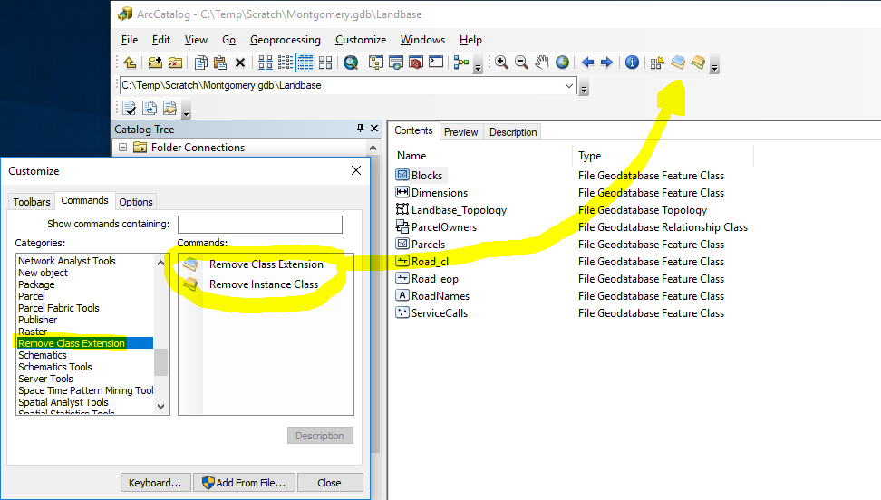
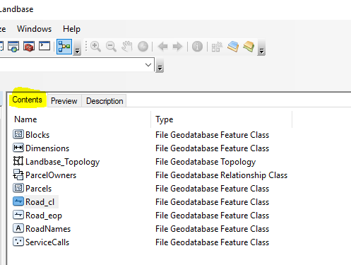

# Remove Class Extension

# Description

This is an Add-in for ArcCatalog. In categories 'Remove class extension' you have two buttons: remove class extension and remove instance class. 

Select from ArcCatalog a feature class from tab Contents

If you have a feature class that has a class extension associated or a feature class that is a custom object whose behavior class
you can use this add-in that remove the reference and set null.

When previewing a feature class or adding it to a map, one of the following error messages occurs: 
<ul>
<li>“Error opening feature class. Unable to create object class extension COM component.”</li> 
<li>“Error opening feature class. 
Unable to create object class COM component.” </li>
</ul>

In the first case, the feature class has a class extension associated that is not installed on the client machine. 
Using remove class extension you resolve this problem. 

In the second case, the feature class is a custom object whose behavior class is not installed on the client machine. 
Using remove instance class you resolve this problem.

This add-in runs also for annotation and dimension with class extension or custom object

For details: [http://support.esri.com/fr/knowledgebase/techarticles/detail/17755](https://support.esri.com/en-us/knowledge-base/error-opening-feature-class-unable-to-create-object-cla-000002980)

# Requirements 
ArcGIS 10.7.1 Desktop or superior
